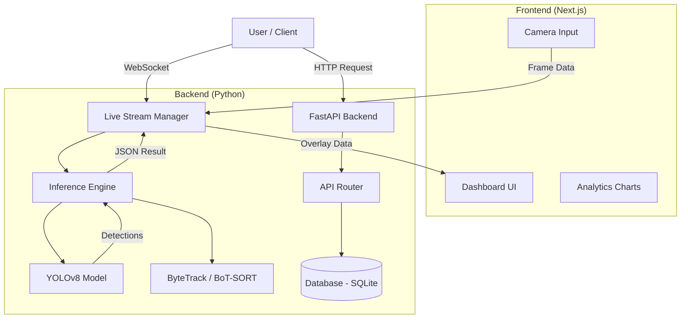

# System Architecture - AI-Powered Garbage Detection

## 1. High-Level Overview

The system follows a **Client-Server** architecture with a real-time inference pipeline.

## 2. Component Details

### A. Frontend (Next.js + Vanilla CSS)
*   **Role**: User Interface, Camera capture, Visualization.
*   **Tech**: React, Next.js 14, Vanilla CSS (Glassmorphism).
*   **Key Modules**:
    *   `LiveDetection`: Captures webcam frames, sends to backend via WebSocket, renders received bounding boxes on canvas overlay.
    *   `AnalyticsDashboard`: Fetches historical data from API and renders charts.
    *   `FileUpload`: Handles drag-and-drop image/video uploads.

### B. Backend (FastAPI)
*   **Role**: Model hosting, API, State management.
*   **Tech**: Python 3.9+, FastAPI, Uvicorn.
*   **Key Modules**:
    *   `main.py`: App entry point, CORS setup.
    *   `inference.py`: Singleton class loading YOLOv8 model. Handles `predict()` and post-processing (NMS, formatting).
    *   `websocket_manager.py`: Manages active WS connections. Handles frame decoding -> inference -> encoding -> broadcast.

### C. AI Engine (YOLOv8)
*   **Input**: Images (640x640), Video Frames.
*   **Output**: Bounding Boxes (xyxy), Class ID, Confidence.
*   **Optimization**:
    *   **Threaded Video Processing**: Use `cv2.VideoCapture` in a separate thread to prevent I/O blocking.
    *   **Batching**: (Optional) For uploaded videos, process frames in batches.

### D. Data Storage
*   **Database**: SQLite (for simplicity/portability).
*   **Schema**:
    *   `detections`: id, timestamp, waste_type, confidence, source (live/upload).
    *   `sessions`: id, start_time, end_time, total_items.

## 3. Data Flow

### Live Detection Flow
1.  **Capture**: Browser captures video frame (e.g., @ 30fps).
2.  **Send**: Frame converted to Base64/Blob -> WebSocket -> Backend.
3.  **Process**:
    *   Backend decodes image.
    *   YOLOv8 inference runs.
    *   Results (Box coords, Label) extracted.
4.  **Respond**: Backend sends JSON packet `{ "boxes": [...], "stats": {...} }` back to Client.
5.  **Render**: Client draws boxes on `<canvas>` overlaid on `<video>`.

### Upload Flow
1.  **Upload**: User POSTs image/video to `/api/upload`.
2.  **Process**: Server saves file -> Runs inference.
3.  **Result**: Returns JSON with detection data + URL of processed image (with drawn boxes).

## 4. Deployment Strategy
*   **Docker**: Multi-stage build.
    *   *Base*: `python:3.9-slim`.
    *   *Dependencies*: `opencv-python-headless`, `ultralytics`, `fastapi`.
*   **GPU Support**: Use `nvidia/cuda:11.8.0-cudnn8-runtime-ubuntu22.04` base image if GPU is available.
